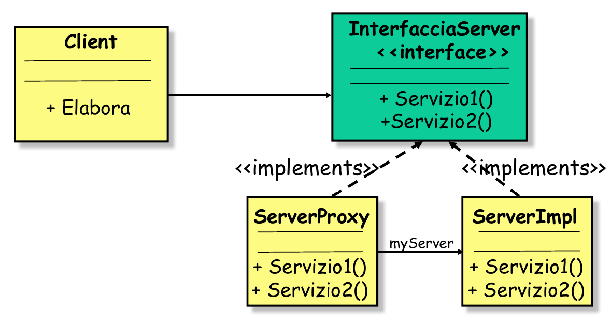
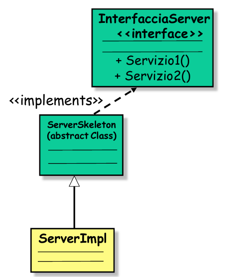
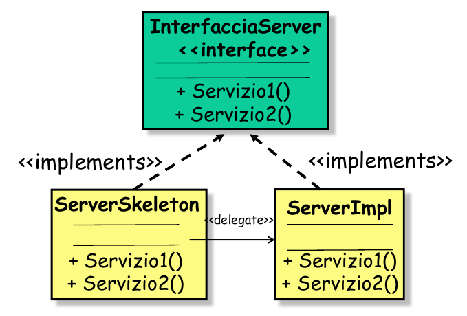

## Il pattern Proxy - Skeleton
**Problema**: l'implementazione dei meccanismi di comunicazione "distrae" dalla  realizzazione delle funzionalità effettive dell'applicazione, si sovrappongono la logica applicativa e quella di comunicazione; idealmente infatti:

- il **programmatore lato client** dovrebbe concentrarsi sulla *logica applicativa* invocando i servizi del server, separando la logica di comunicazione con il server stesso;

- il **programmatore lato server** dovrebbe concentrarsi sull'implementazione dei *servizi offerti*, separandola dalla logica di comunicazione con il client;

Per risolvere il problema:

### Lato client - Proxy
Il **proxy** costituisce praticamente un'implementazione locale (al client) del *servizio remoto*; implementa tutti i meccanismi di "basso livello" necessari per l'instaurazione della comunicazione, e per l’invio/ricezione dei parametri delle invocazioni tramite TCP o UDP con il server;

> Il concetto è che il client usa il proxy per il servizio, che invece si fa carico di comunicare con il server.

A livello **progettuale**, una `InterfacciaServer` viene implementata sia dal "server vero" (`ServerImpl`), sia dal server proxy, con quest'ultimo che mantiene un riferimento al primo, appunto per inoltrarvi le richieste del client.



### Lato server - Skeleton
Lo **Skeleton** è un proxy lato server che si fa carico della comunicazione con il Proxy lato client. La chiamata dello Skeleton al server "vero" prende il nome di ***upcall***.

Il pattern **skeleton** si può costruire in due modi:

- per **ereditarietà** - una `InterfacciaServer`, viene implementata da una classe astratta `Skeleton` (astratta per i servizi, concreta per la comunicazione) e una classe `ServImpl` eredita da essa. Il "vantaggio" di questa implementazione è che `ServImpl` eredita tutti i meccanismi di comunicazione
    - è semplice da implementare
    - poco attraente
    - nei linguaggi a ereditarietà singola `ServImpl` non può ereditare altre utilities (e.g Database)
  
        

- per **delega** - una `InterfacciaServer` viene implementata sia dallo skeleton che da `ServerImpl`, ma lo skeleton mantiene un riferimento a `ServerImpl` (`delegate`) è quindi i servizi li chiama su di lui:

    ```
    Servizio1() {
        delegate.Servizio1();
    }
    ```


    - sicuramente più complesso
    - struttura più pulita ed elegante
    - serverImpl può ereditare da altri
  
    